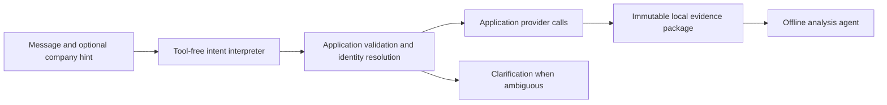

# Application-owned research preparation

Free-form chat remains the entry point. An optional company/ticker hint helps
interpret a request; it is user input, not a verified identity. The application
now retrieves evidence before starting the analysis agent.

## Responsibilities and boundaries

The interpreter proposes one of conversation, research, prices, comparison or
clarification, with at most two company mentions and a bounded date range. It
uses the existing runtime port, has no tools or web search, and must return
strict, size-limited JSON. Application code validates its output. It cannot
choose arbitrary URLs, plugins, commands or financial concepts.

The application resolves mentions through source-backed company resolution.
Exact names, tickers and explicitly entered CIKs are supported. A sole fuzzy
match still requires clarification. The SEC company identifier is distinct from
a trading instrument: prices require saved listing evidence and a verified
company-to-market-instrument binding. Multiple listings or competing provider
instances require clarification/configuration rather than an implicit choice.
The model's memory never serves as a ticker-to-CIK mapping.

Existing SEC EDGAR and Yahoo Finance plugins provide the data; a new network
plugin was unnecessary. Provider process protocols, persistence and runtime
interfaces remain separate. The current price adapter explicitly supports the
`yfinance` plugin's native instrument identifiers. Another market provider needs
an explicit identifier/binding adapter; it is not automatically interchangeable.

Preparation persists the exact JSON injected into analysis, once per run, before
analysis starts. It contains verified identities, provider fetch receipts,
dataset samples, view receipts and explicit issues. Full saved datasets remain
available through scoped offline reads. SQLite schema version 6 adds immutable
preparation records; failed analysis does not discard successfully prepared data.
Conversation history is bounded with space reserved for evidence.

The default `ConversationHost::start` enforces this flow. Analysis receives only
an explicit offline evidence-tool allowlist with web search disabled. Dispatch
also rejects hidden retrieval calls. `start_with_interpreter` supports other
interpretation implementations. `start_with_tools` is an explicit low-level
legacy API retained for library clients and lifecycle fixtures; desktop chat
does not use it.

## Supported scope

- Price requests default to the previous 12 months of daily prices.
- Company research and two-company comparison default to the previous 60 months.
- Explicit historical date ranges are supported up to ten calendar years.
- Research prepares filing metadata and a fixed set of reported US-GAAP/USD
  facts: assets, liabilities, cash, debt, revenue and net income. Source concepts,
  periods and units remain intact. No synthetic quarters or currency conversions
  are introduced; this is not exhaustive financial-statement coverage.
- Price charts and an assets table are prepared by the application. Filing
  documents are not automatically downloaded or interpreted in this version.
- Ordinary conversation can use the previous saved evidence without a new fetch.
  Follow-up research can reuse exact successful fetches for 15 minutes, retaining
  original source timestamps. No automatic background refresh occurs.

Arbitrary messages are accepted, but arbitrary retrieval workflows are not yet
implemented. Unsupported or ambiguous research must be clarified instead of
turning a model proposal into unconstrained network access.

## Failure behavior

| Failure | Behavior |
| --- | --- |
| Invalid interpretation or unavailable model | Bounded failure; no financial retrieval |
| Ambiguous company or listing | Clarification before unsafe identity selection |
| One source/metric fails | Preserve available evidence and inject the missing-data issue |
| Provider rate limit or access denial | Existing bounded recovery/cooldown policy; no access-control bypass |
| View creation fails | Preserve its dataset and report the presentation issue |
| Cancel or overall deadline | Cancel active preparation, bound interpreter cleanup, persist terminal status |
| Analysis fails | Keep immutable preparation for inspection and follow-up |
| Long history or large source output | Bound history and samples; retain offline paging instead of truncating JSON |

See [data-fetch recovery](data-fetch-recovery.md) for plugin-level retry and
cooldown behavior. A missing observation is not zero, and cached evidence is not
represented as newly fetched.

## Validation and remaining limits

Deterministic integration tests exercise actual provider subprocess fixtures,
SQLite persistence/reopening, exact-name fallback, ambiguity, comparison, cached
follow-ups, source failures, cancellation and rejection of analysis fetches.
Desktop tests exercise the default flow and saved views. These tests do not
establish live SEC/Yahoo availability or the accuracy of a live model's intent
interpretation. General international statements, arbitrary metrics, document
research and more than two-company comparisons need additional typed workflows.
